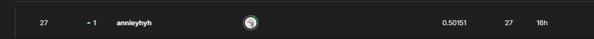
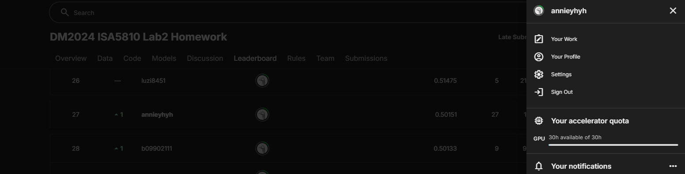

# DM2024-Lab2-master
ISA5810 Data Mining Lab 2

## Student Information
    Name: 陳映璇
    Student ID: r12528053
    GitHub ID: weew2000
    Kaggle name: annieyhyh
    Kaggle private scoreboard snapshot: (27/147)

## Instructions
1. First: This part is worth 30% of your grade. Do the take home exercises in the DM2024-Lab2-master Repo. You may need to copy some cells from the Lab notebook to this notebook.
    - file : [DM2024-Lab2-Master.ipynb](./DM2024-Lab2-Master.ipynb)

2. Second: This part is worth 30% of your grade. Participate in the in-class Kaggle Competition regarding Emotion Recognition on Twitter by this link: https://www.kaggle.com/competitions/dm-2024-isa-5810-lab-2-homework. The scoring will be given according to your place in the Private Leaderboard ranking. 

    Screenshot of your position at the end of the competition and store it as '''score.png''' under the img folder of this repository and return the cell Student Information.

    - Screenshot:

    - Student information:

3. Third: This part is worth 30% of your grade. A report of your work developping the model for the competition (You can use code and comment it). This report should include what your preprocessing steps, the feature engineering steps and an explanation of your model. You can also mention different things you tried and insights you gained.
    - file : [Report](./kaggle_competition/Report.pdf)

4. Fourth: This part is worth 10% of your grade. It's hard for us to follow if your code is messy, so please tidy up your notebook.
Upload your files to your repository then submit the link to it on the corresponding e-learn assignment.